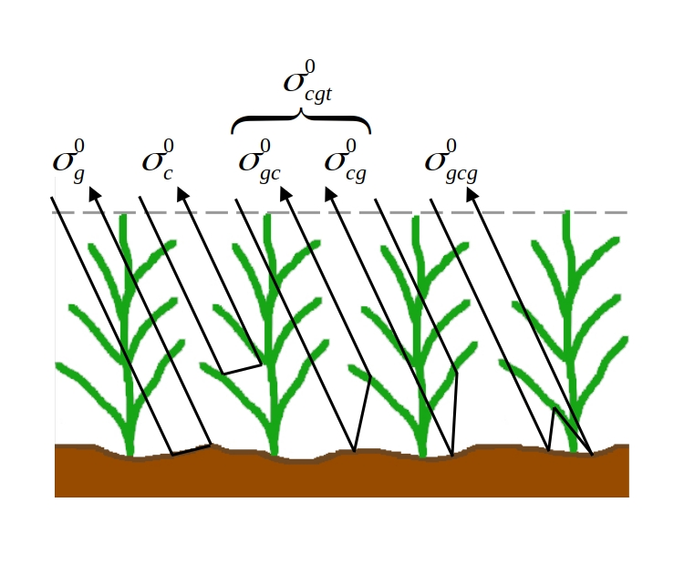
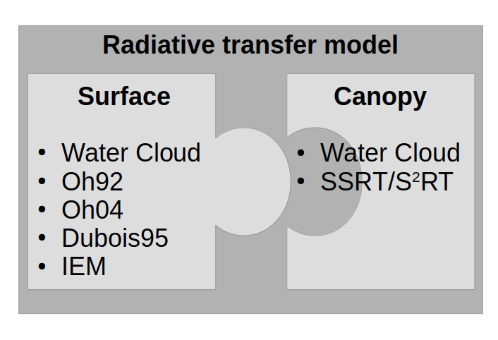

.. _Theory:

Implemented microwave Radiative Transfer (RT) models
======================================================
The backscattering signal of a ground pixel consists of surface scattering, canopy scattering, or a combination of both
:cite:`ulaby_microwave_2014`. Right now the implemented RT models focus on areas with open soil
(surface-scattering RT models) and vegetated (surface+canopy-scattering models) land surfaces.
A schematic overview of considered scattering mechanism within the RT models is shown in :numref:`scattering_machanism`.
The Water Cloud Model (WCM) considers only :math:`\sigma_g^0` and :math:`\sigma_c^0`
whereas the Single Scattering Radiative Transfer model considers all illustrated scattering mechanism.

.. _scattering_machanism:

   Schematic overview of scattering mechanism

An overview of the implemented surface and canopy RT models is given in :numref:`rt_model`

.. _rt_model:

   Schematic overview of currently implemented RT models

.. _surface:

Surface-scattering RT models
------------------------------

.. _surface_wcm:

Water Cloud Model (WCM) surface part
~~~~~~~~~~~~~~~~~~~~~~~~~~~~~~~~~~~~~

The surface-scattering part (:math:`\sigma_s^0`) of the WCM from Attema and Ulaby (1978) :cite:`attema_vegetation_1978`
for a given polarizationn :math:`pq` (:math:`pq = HH`, :math:`VV`, or :math:`HV`) is defined as

.. math:: \sigma_{s_{pq}}^0 = C_{pq} + D_{pq} \cdot mv

with :math:`C_{pq}`, :math:`D_{pq}` as empirical fitted parameters and :math:`mv` as soil moisture content.
As the WCM is a purely empirical model, the calibration parameters :math:`C_{pq}` and :math:`D_{pq}`
have to be calibrated for each test site individually.

Oh model 1992 (Oh92)
~~~~~~~~~~~~~~~~~~~~~

Oh et al. (1992) :cite:`oh_empirical_1992` developed a RT model for surface-scattering (:math:`\sigma_s^0`)
which is based on soil moisture and surface roughness in-situ and scatterometer measurements. The empirical determined
functions for the different polarizations :math:`VV`, :math:`HH`, and :math:`HV` are

.. math::

   \begin{aligned}
   \sigma_{s_{VV}}^0 &= 0.7 \ \left [1-e^{-0,65(ks)^{1.8}} \left] \ \frac{cos^3\theta}{\sqrt{p}} \  \right[ R_v(\theta)+R_h(\theta) \right] \\
   \sigma_{s_{HH}}^0 &= p \ \sigma_{s_{VV}}^0 \\
   \sigma_{s_{HV}}^0 &= q \ \sigma_{s_{VV}}^0 \end{aligned}

with

.. math:: p = \frac{\sigma_{s_{HH}}^0}{\sigma_{s_{VV}}^0} = \left [1- \left (\frac{2\theta}{\pi} \right )^{\frac{1}{3R_0}} \cdot e^{-ks} \right]^2

.. math:: q = \frac{\sigma_{s_{HV}}^0}{\sigma_{s_{VV}}^0} = 0.23 \ \sqrt{R_0} \ (1-e^{-ks})

where :math:`\theta` stands for the local incidence angle, :math:`k` is the radar wave number
(:math:`k = 2\pi / \lambda`), :math:`\lambda` is the wavelength, and :math:`s` is the rms height.
The Fresnel reflectivity coefficient at nadir :math:`R_0` as well as for horizontal :math:`R_h` and vertical
:math:`R_v` polarization can be written as

.. math::

   \begin{aligned}
   R_0 &= \left | \frac{1-\sqrt{\epsilon_r}}{1+\sqrt{\epsilon_r}} \right |^2 \\
   R_{h} &= \frac{\mu_r cos\theta - \sqrt{\mu_r\epsilon_r - sin^2\theta}}{\mu_r cos\theta + \sqrt{\mu_r\epsilon_r - sin^2\theta}},  \label{eq:R_h} \\
   R_{v} &= \frac{\epsilon_r cos\theta - \sqrt{\mu_r\epsilon_r - sin^2\theta}}{\epsilon_r cos\theta + \sqrt{\mu_r\epsilon_r - sin^2\theta}}, \label{eq:R_v}\end{aligned}

with :math:`\epsilon_r` describing the relative dielectric constant and :math:`\mu_r` describing the relative
permittivity. The model Oh92 was developed for different frequencies (X- to L-Band) and a broad range of incidence
angles (10–70°). The authors state a validity range under bare soil conditions for soil moisture of
9 Vol.% < mv < 31 Vol.% and for surface roughness of 0.1 < ks < 6 :cite:`oh_empirical_1992`.

Oh model 2004 (Oh04)
~~~~~~~~~~~~~~~~~~~~~

Based on further research by Oh et al. (2002) :cite:`oh_semi-empirical_2002` and Oh (2004)
:cite:`yisok_oh_quantitative_2004` the original apporach from 1992 (Oh92) was simplified by using soil moisture
(:math:`mv`) instead of dielectric constant (:math:`\epsilon_r`) and fresnel reflectivity equations.
Thus, in case of transforming the dielectric constant to soil moisture values, no additional information about
soil properties (bulk density, sand and clay content) is needed. The model description of Oh04
:cite:`yisok_oh_quantitative_2004` can be written as

.. math::

   \begin{aligned}
   p = \frac{\sigma_{s_{HH}}^0}{\sigma_{s_{VV}}^0} &= 1 - \left (\frac{2\theta}{\pi} \right )^{0.35 \ mv^{-0.63}} \cdot e^{-0.4 \ (ks)^{1.4}}, \\
   q = \frac{\sigma_{s_{HV}}^0}{\sigma_{s_{VV}}^0} &= 0.095 \ (0.13+sin^{1.5}\theta)^{1.4} \ [1-e^{-1.3 \ (ks)^{0.9}}], \\
   \sigma_{s_{HV}}^0 &= 0.11 \ mv^{0.7} \ (cos\theta)^{2.2} \ [1-e^{-0.32 \ (ks)^{1.8}}].\end{aligned}

Oh04 is optimized for bare soil conditions and surface roughness of 0.13 < ks < 6.98, soil moisture
of 4 Vol.% < mv < 29.1 Vol.% and incidence angle 10° < :math:`\theta` < 70° :cite:`yisok_oh_quantitative_2004`.

Dubois model (Dubois95)
~~~~~~~~~~~~~~~~~~~~~~~~
In 1995, another empirical based surface-scattering RT model for polarization VV and HH was developed by
Dubois et al. (1995) :cite:`dubois_measuring_1995`.
Backscatter measurements of scatterometers for different frequencies (2.5 GHz to 11 GHz) and incidence angles
(30° to 60°) were fitted, thus Dubois et al. :cite:`dubois_measuring_1995` (Dubois95) proposed

.. math::

   \begin{aligned}
   \sigma_{s_{HH}}^0 &= 10^{-2.75} \ \frac{cos^{1.5}\theta}{sin^5\theta} \ 10^{\ 0.028 \ \epsilon_r \ tan\theta} \ (ks \cdot sin\theta)^{1.4} \ \lambda^{0.7}, \\
   \sigma_{s_{VV}}^0 &= 10^{-2.37} \ \frac{cos^{3}\theta}{sin^3\theta} \ 10^{\ 0.046 \ \epsilon_r \ tan\theta} \ (ks \cdot sin\theta)^{1.1} \ \lambda^{0.7} .\end{aligned}

Dubois95 was optimized for bare soil conditions with :math:`mv \leq` 35 Vol.% and :math:`ks \leq 2.5`.

Integral Equation Model (IEM)
~~~~~~~~~~~~~~~~~~~~~~~~~~~~~

In 1992, Fung et al. :cite:`fung_backscattering_1992` developed a theoretical surface-backscattering model named
Integral Equation Model (IEM). Over the years the original model was extended to bistatic scattering
:cite:`fung_improved_2002`.

The co-ploarized backscatter :math:`\sigma_{pp}^0` (:math:`pp = VV` or :math:`HH`) is defined as

.. math:: \sigma_{s_{pp}}^0 = \frac{k^2}{4\pi} \ e^{k^2s^2cos^2\theta} \ \sum_{n=1}^{\infty} |I^n_{pp}|^2 \ \frac{W^n \ (2ksin\theta,0)}{n!},

where :math:`I_{pp}^n` is defined as

.. math:: I_{pp}^n = (2 \ ks \ cos\theta)^n f_{pp} e^{-k^2s^2cos^2\theta} + (ks \ cos\theta)^n \ F_{pp}

:math:`W^n` specifies the Fourier transformation of the nth power of th surface correlation function :math:`p(x,y)`.
The cross polarization :math:`\sigma_{s_{HV}}^0` can be calculated by

.. math::

   \begin{split}
   \sigma_{s_{HV}}^0 & = \frac{k^2}{16\pi} \ e^{-2k^2s^2cos^2\theta} \sum_{n=1}^{\infty} \sum_{m=1}^{\infty} \frac{(k^2s^2cos^2\theta)^{n+m}}{n!m!} \\
   & \int [|F_{HV}(u,v)|^2+F_{HV}(u,v)F_{HV}^*(-u,-v)] \ W^n(u-k \ sin\theta, v) \ W^m(u+k \ sin\theta) \ dudv.
   \end{split}

where the Kirchhoff coefficients :math:`f_{HH}`, :math:`f_{VV}` and complementary field coefficients
:math:`F_{HH}`, :math:`F_{VV}`, :math:`F_{HV}` are formulated as

.. math::

   \begin{aligned}
   f_{HH} &= \frac{2R_h}{cos\theta}, \\
   f_{VV} &= \frac{2R_v}{cos\theta}, \\
   F_{HH} &= 2 \frac{sin^2\theta}{cos\theta} [4R_h - (1 - \frac{1}{\epsilon_r} (1 + R_h)^2)], \\
   F_{VV} &= 2 \frac{sin^2\theta}{cos\theta} [(1 - \frac{\epsilon cos^2\theta}{\mu_r \epsilon_r - sin^2\theta}) (1 - R_v)^2 + (1 - \frac{1}{\epsilon_r})(1 + R_v)^2], \\
   F_{HV}(u,c) &= \frac{U v}{k cos\theta} [\frac{8R^2}{\sqrt{k^2 - u^2 - v^2}} + \frac{-2 + 6R^2 + \frac{(1 + R)^2}{\epsilon_r} + \epsilon_r (1 - R)^2}{\sqrt{\epsilon_r k^2 - u^2 - v^2}}] \\\end{aligned}

R is described by the horizontal :math:`R_h` (`[eq:R_h] <#eq:R_h>`__)) and vertical
:math:`R_v` (`[eq:R_v] <#eq:R_v>`__)) Fresnel coefficient and can be written as

.. math:: R = \frac{R_v - R_h} {2}

The Fourier transformation of the nth power of the surface correlation
coefficient :math:`W^n(a,b)` is defined as

.. math:: W^n(a,b) = \frac{1}{2\pi} \int\int p^n(x,y)e^{-i(ax+by)}dxdy

The distribution of surface correlation function :math:`p(x,y)` is depicted for low surface roughness as Exponential
and high surface roughness as Gaussian.

.. math::

   \begin{aligned}
   p(x,y) &= e^{-(\frac{|x|+|y|}{L})} \ (Exponential), \\
   p(x,y) &= e^{-(\frac{x^2+y^2}{L^2})} \ (Gaussian),\end{aligned}

where :math:`L` is the correlation length.

Canopy-scattering RT models
----------------------------
Due to many individual scatterers (leaves, needles, and branches) the vegetation canopy is usually described as a
canopy-scattering medium. Depending on parameters like radar wavelength or vegetation density the observed backscatter
includes scattering components from the soil surface as well as multiple scattering contributions from surface and
canopy interactions.

Water Cloud Model (WCM)
~~~~~~~~~~~~~~~~~~~~~~~~~~~~~~~~~~~~
The original WCM was developed by Attema and Ulaby (1978) :cite:`attema_vegetation_1978`.
For keeping the model approach as simple as possible serval assumptions were made.
It is assumed that the direct canopy backscattering  (:math:`\sigma_{c_{pq}}^0`) is the predominant mechanism
which is responsible for backscatter signal from the canopy. Furthermore, the vegetation canopy is considered
to be a collection of spherical water droplets which are uniformely distributed. Thus, the main describing
variables for the canopy layer are vegetation height and cloud density which are assumed to be proportional
to the volumetric water content :cite:`attema_vegetation_1978`.

Combining surface (\sigma_{s}^0) and canopy (\sigma_{c}^0) scattering the WCM for for a given polarization
:math:`pq` (:math:`pq = HH`, :math:`VV`, or :math:`HV`) for vegetation areas is defined as

.. math::

   \label{eq:WCM}
   \sigma_{pq}^0 = \sigma_{c_{pq}}^0 + T^2\sigma_{s_{pq}}^0
   \sigma_{g_{qp}} = T^2\sigma_{s_{pq}}^0

where :math:`\sigma_{c_{pq}}^0` (direct canopy backscatter) and :math:`T_{pq}^2` (two-way attenuation by the canopy)
are described as

.. math::

   \begin{aligned}
   \sigma_{c_{pq}}^0 &= A_{pq} \ V_1 \ cos\theta \ (1-T_{pq}^2), \\
   T_{pq}^2 &= e^{-2 \ B_{pq} \ V_2 \ sec\theta} \label{eq:T_wcm}\end{aligned}

:math:`A_{pq}` and :math:`B_{pq}` are two fitted model parameters, :math:`V1` and
:math:`V2` are empirical vegetation descriptors and :math:`\theta` stands for
the local incidence angle. The surface part of the WCM :math:`\sigma_{s_{pq}}^0` was described in
section :ref:`surface_wcm`, although in theory the WCM surface part can be substituted by each surface
RT model of section :ref:`surface`

Single Scattering Radiative Transfer model (SSRT)
~~~~~~~~~~~~~~~~~~~~~~~~~~~~~~~~~~~~~~~~~~~~~~~~~
In order to account not just for the direct canopy backscatter, but also for multiple canopy-surface scattering
interactions, more sophisticated models like the SSRT were developed. The SSRT model described by de Roo et al. (2001)
:cite:`de_roo_semi-empirical_2001` or Ulaby and Long (2014) :cite:`ulaby_microwave_2014` is a semi-empirical
first-order scattering model. A graphical overview of the different scattering mechanisms is given in Figure ....
The model consists of a ground component :math:`\sigma_{g_{pq}}^0` (:math:`\sigma_{g}^0 = \sigma_{s}^0 * T^2`),
the direct canopy backscatter :math:`\sigma_{c_{pq}}^0`, ground plant :math:`\sigma_{gc}^0` and plant ground
:math:`\sigma_{cg}^0` scattering, and a ground plant ground :math:`\sigma_{gcg_{pq}}^0` contribution.
Thus, the SSRT can be written as

.. math::

   \label{eq:SSRT2}
   \sigma^0 = \sigma_{g}^0 + \sigma_{c}^0 + \sigma_{cg}^0 + \sigma_{gc}^0 + \sigma_{gcg}^0

or with

.. math::
   \sigma_{cgt}^0 = \sigma_{cg}^0 + \sigma_{gc}^0

as

.. math::

   \label{eq:SSRT}
   \sigma_{pq}^0 = \sigma_{g_{pq}}^0 + \sigma_{c_{pq}}^0 + \sigma_{cgt_{pq}}^0 + \sigma_{gcg_{pq}}^0

The ground component :math:`\sigma_{g_{pq}}^0` is defined as

.. math:: \sigma_{g_{pq}}^0 = T_p T_q \ \sigma_{s_{pq}}^0,

For the surface scattering :math:`\sigma_{s_{pq}}^0` each of the surface models in Section :ref:`surface` can be used.
The :math:`p` or :math:`q` (p, q = v or h polarization) polarized one way transmittivity of the canopy
(:math:`T_p` or :math:`T_q`) is defined by

.. math:: T_p = e^{-\tau_p}, \label{eq:T_ssrt}

with the optical depth :math:`\tau_p` as

.. math:: \tau_p = k_e^p \ H \ sec\theta, \label{eq:tau_ssrt}

whereas :math:`H` represents the canopy height and :math:`\theta` is the local incidence angle.
The extinction coefficient :math:`k_e^p` accounts for the absorption and
scattering losses of the electromagnetic wave through the canopy and can be written as

.. math:: k_e^p = k_a^p + k_s^p

with

.. math:: k_s^p = k_e^p \ \omega

where :math:`\omega` is describing the single scattering albedo.
Generally, canopies are composed of leaves, stalks, and branches that vary in shape and orientation,
exhibiting no linear distributions in the vertical plane.
However, for simplicity reasons, :math:`k_e^p`, :math:`k_a^p`, and :math:`k_s^p` are assumed to follow
uniformly distribution in the vertical within the canopy layer.

The direct canopy scattering :math:`\sigma_{c_{pq}}^0` is described by

.. math:: \sigma_{c_{pq}}^0 = \frac{\sigma_{V_{pq}}^{back} \ cos\theta}{k_e^p + k_e^q} \ (1 - T_p T_q)

with the canopy backscattering coefficient :math:`\sigma_{V_{pq}}^{back}` of the vegetation medium

.. math:: \sigma_{V_{pq}}^{back} = N_v \  \sigma_{pq}^{back}

:math:`N_v` is the number of scattering particles per unit volume
and :math:`\sigma_{pq}^{back}` is the polarized backscattering cross section of a single particle.

The ground canopy (:math:`\sigma_{gc_{pq}}^0`) and
canopy ground (:math:`\sigma_{cg_{pq}}^0`) scattering contributions are defined by

.. math::

   \begin{aligned}
   \sigma_{gc_{pq}}^0 = \sigma_{v_{pq}}^{bist} \ H \ R_q \ T_p T_q, \\
   \sigma_{cg_{pq}}^0 = \sigma_{v_{pq}}^{bist} \ H \ R_p \ T_p T_q,\end{aligned}

where :math:`H` represents the canopy height, :math:`\sigma_{v_{pq}}^{bist}` describes
the bi-static scattering cross section of a single leaf or stalk, and
:math:`R_p` is the polarized Fresnel reflectivity
(Equations (`[eq:R_h] <#eq:R_h>`__) and (`[eq:R_v] <#eq:R_v>`__)).

The total canopy ground contribution :math:`\sigma_{cgt_{pq}}^0` as the sum of
:math:`\sigma_{gc_{pq}}^0` and :math:`\sigma_{cg_{pq}}^0` is defined as

.. math:: \sigma_{cgt_{pq}}^0 = \sigma_{v_{pq}}^{bist} \ H \ [R_p + R_q] \ T_p T_q

The ground canopy ground contribution of the SSRT
(:math:`\sigma_{gcg_{pq}}^0`) can be written as

.. math:: \sigma_{gcg_{pq}}^0 = \frac{\sigma_{V_{pq}}^{back} \ cos\theta}{k_e^p + k_e^q} \ (R_p R_q - T_p T_q) .

Isotropic Scatterers
^^^^^^^^^^^^^^^^^^^^^
The scattering pattern for isotropic scatterers is assumed to be uniform along all directions
:cite:`ulaby_microwave_2014`. Thus,

.. math:: \sigma_v^{back} = \sigma_v^{bist} = k_s

Rayleigh Scatterers
^^^^^^^^^^^^^^^^^^^^^
With the assumption of Rayleigh particle, the scatting pattern for hh and vv polarization :cite:`ulaby_microwave_2014`
is assumed to be

.. math:: \sigma_v^{back} = \sigma_v^{bist} = \frac{3}{2} k_s

Implemented dielectric mixing models for soil
==============================================
The retrieval of soil moisture by the use of microwave remote sensing and RT models are often dependent on
dielectric mixing models.

n the RTM, dielectric mixing models (DMMs) are particularly important in linking soil moisture to emissivity.
The DMMs mix the dielectric properties of water and soil, while accounting for physical soil properties
such as soil temperature and texture.

Further, several working models have
been developed for the calculation of complex
permittivity of the wet soils in terms of texture
structure, frequency of measurement, moisture
content, bound and free water permittivity and bulk
dry density of soil at given temperature

Simplistic apprach
--------------------
The simplistic approach by Dobson (Temperature T=23°C, bulk density :math:`\rho_b` = 1.7 g/cm3) is given by

.. math::

   \begin{aligned}
   \epsilon_{w}^{'} = 4.9 + \frac{74.1}{1+(f/f_0)^2} \\
   \epsilon_{w}^{''} = \frac{74.1 \ (f/f_0)}{1+(f/f_0)^2}+6.46 \ \frac{\sigma}{f}
   \end{aligned}

.. math::

   \begin{aligned}
   \epsilon_{w}^{'} &= 4.9 + \frac{74.1}{1+(f/f_0)^2} \\
   \epsilon_{w}^{''} &= \frac{74.1 (f/f_0)}{1+(f/f_0)^2} + 6.46 \frac{\sigma}{f}
   \end{aligned}

with frequency :math:`f` (GHz) and :math:`f_0` = 18.64 GHz (relaxing frequency of water at 23°C).

Dobson et al. (1985)
---------------------

.. math::

   \begin{aligned}
   \alpha = 0.65 \\
   \beta_1 = 1.27 - 0.519S - 0.152C \\
   \beta_2 = 2.06 - 0.928S - 0.255C \\
   \sigma = -1.645 +1.939 \rho_b - 2.256S + 1.594C
   \end{aligned}

single Debye dielectric model for pure water. Eqs. 4.14

.. math::

   \begin{aligned}
   \epsilon_{w}^{'} = \epsilon_{w\infty} + \frac{\epsilon_{w0} - \epsilon_{w\infty}}{1+(2\pi f\tau_w)^2} \\
   \epsilon_{w}^{''} = \frac{2\pi f\tau_w (\epsilon_{w0} - \epsilon_{w\infty})}{1 + (2\pi f\tau_w)^2}
   \end{aligned}

Debye model with conductivity term for e2. Eqs. 4.67

.. math::

   \begin{aligned}
   \epsilon_{w}^{'} = \epsilon_{w\infty} + \frac{\epsilon_{w0} - \epsilon_{w\infty}}{1+(2\pi f\tau_w)^2} \\
   \epsilon_{w}^{''} = \frac{2\pi f\tau_w (\epsilon_{w0} - \epsilon_{w\infty})}{1 + (2\pi f\tau_w)^2} + (\frac{2.65-\rho_b}{2.65m_v}) \frac{\sigma}{2\pi \epsilon_0 f}
   \end{aligned}

:math:`\epsilon_0 = 8.854 x 10^{-12}` F\m
:math:`\epsilon_{w\infty} = 4.9` after Lane and Saxton (1952

.. math::

   \epsilon_{w0}(T) = 88.045 - 0.4147T + 6.295 x 10^{-4}T^2 + 1.075 x 10^{-5} T^3

The relaxation time of pure water is defined by

.. math::

   2 \pi \tau_w (T) = 1.1109x10^{-10} - 3.824x10^{-12}T + 6.938x10^{-14}T^2 - 5.096x10^{-16}T^3

dielectic permittivity

.. math::

   \begin{aligned}
   \epsilon_{soil}^{'} = [1 + 0.66 \rho_b + m_v^{\beta_1} (\epsilon_w^{'})^{\alpha} - m_v]^{1/\alpha} \\
   \epsilon_{soil}^{''} = m_v^{\beta_2} \epsilon_w^{''}
   \end{aligned}

.. rubric:: References
.. bibliography:: references.bib
   :style: unsrt