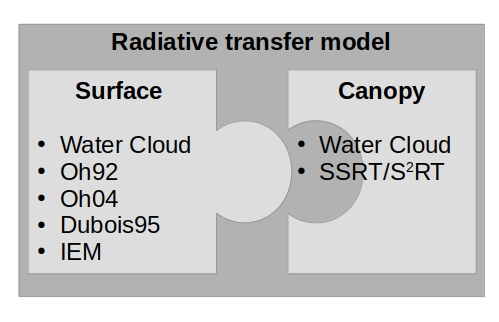

# Summary
<!-- Copy from introduction text block -->
SenSE is a comprehensive community framework designed for radiative transfer (RT) modeling in the active microwave domain.
It summarizes various RT models developed for synthetic aperture radar (SAR) to simulate backscatter responses from open soil and vegetated land surfaces, primarily in agricultural settings.
This integration encompasses different models for scattering and emission across various surfaces, providing a cohesive operational structure.

One of the framework's most significant advantages is its modular design, which allows for the easy substitution and analysis of different surface and canopy scattering models within a single system.
This flexibility facilitates seamless model exchange, enhancing the framework's adaptability and utility.
The SenSE package currently includes several surface models such as Oh92 [@oh_empirical_1992], Oh04 [@yisok_oh_quantitative_2004], Dubois95 [@dubois_measuring_1995], IEM [@fung_backscattering_1992], and the surface component of the Water Cloud Model (WCM) [@attema_vegetation_1978].
For canopy modeling, it supports models like SSRT [@de_roo_semi-empirical_2001, @ulaby_microwave_2014] and WCM [@attema_vegetation_1978].

Additionally, the framework incorporates the dielectric mixing model by Dobson et al. [@dobson_microwave_1985], available in various versions for converting soil moisture content to a dielectric constant.
SenSE also includes essential utility functions, such as those for frequency-wavelength conversion and calculating Fresnel reflectivity coefficients, further enhancing its analytical capabilities.

For more detailed information, users are directed to the ReadtheDocs documentation and the original sources of each model, ensuring comprehensive access to technical details and operational guidelines.

# Statement of need
<!-- Copy from documentation text block -->
Over the last several decades, various (empirical to physically based) RT models in the active microwave domain have been developed, tested, and further modified.
However, an easy-to-use framework combining the most common microwave RT models (simulating backscatter responses of active microwave sensors) is lacking.
Thus, every researcher must produce their own code implementation from the original source.
This Python framework aims to serve as a first attempt to combine the most common active microwave-related RT models in a modular way.
As a result, surface and volume scattering models can be easily exchanged with one another.
Such a modular framework provides an opportunity to easily plug and play with different RT model combinations for various research questions and use cases.
SenSE facilitates the application of RT models, especially for comparative analysis.
Over time, the framework is expected to grow, incorporating more RT models (e.g., passive microwave domain) and supplementary functions (e.g., more dielectric mixing models).

# Applications
The Python framework was employed within the EU-sponsored MULTIPLY Project (https://cordis.europa.eu/project/id/687320).
Furthermore, the implementation of RT models in SenSE played a crucial role in the analysis conducted for several publications [@weis_evaluation_2020; @weis_sentinel-1_2021; @weis_rtm-based_2024].
Additionally, the functionalities of SenSE are planned to be utilized in Project 2 - Remote Sensing of Vegetation Canopy Properties: States & Spatio-temporal Dynamics of the Land Atmosphere Feedback Initiative (LAFI) (https://www.lafi-dfg.de/p-2).
Further collaboration with researchers in the field of vegetation optical depths in forest areas is ongoing.
Consequently, the functionality of SenSE will continue to be used, and further extensions of SenSE are anticipated.

# Other available software scripts (Ulaby and Long code library)
Ulaby and Long [@ulaby_microwave_2014] authored an extensive book on the fundamentals of microwave remote sensing, including a wealth of MATLAB codes for demonstration purposes.
However, these MATLAB codes consist of individual snippets from different RT models, which makes it challenging to interchange combinations of RT models.
While the interactive version of the MATLAB codes is effective for demonstration, it does not support processing large datasets.
SenSE addresses the limitations of the MATLAB approach through practical examples provided in various Jupyter notebooks.

# Acknowledgements

In memory of Alexander Löw (&#8224; 2 July 2017) who started this library.

[//]: # (The author also wishes to thank the reviewers and editors for their efforts and for their helpful comments to improve this paper and the software package.)

# References